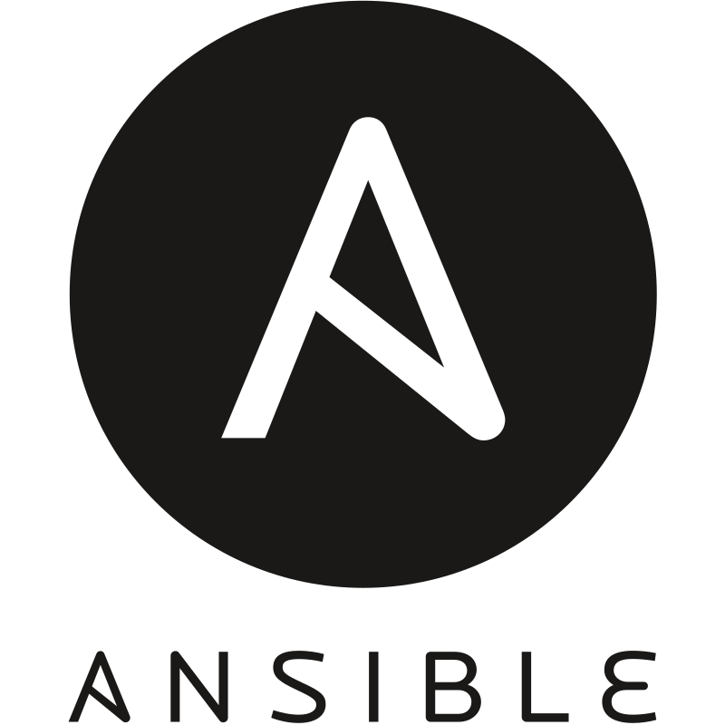

<h1 align="center">Hi 👋, I'm Sahis Neupane</h1>
<h3 align="center">Software engineer with hands-on experience in DevOps and fullstack development. I worked as a Software Engineer Intern at Lockheed Martin, where I supported multiple on-site teams by maintaining and troubleshooting critical internal applications. I also provided technical support to employees, helping resolve account and application issues.</h3>

<h3 align="left">Languages and Tools:</h3>

 

                         

 

<picture>
  <source media="(prefers-color-scheme: dark)" srcset="https://raw.githubusercontent.com/sahisn/sahisn/output/pacman-contribution-graph-dark.svg">
  <source media="(prefers-color-scheme: light)" srcset="https://raw.githubusercontent.com/sahisn/sahisn/output/pacman-contribution-graph.svg">
  
</picture>
